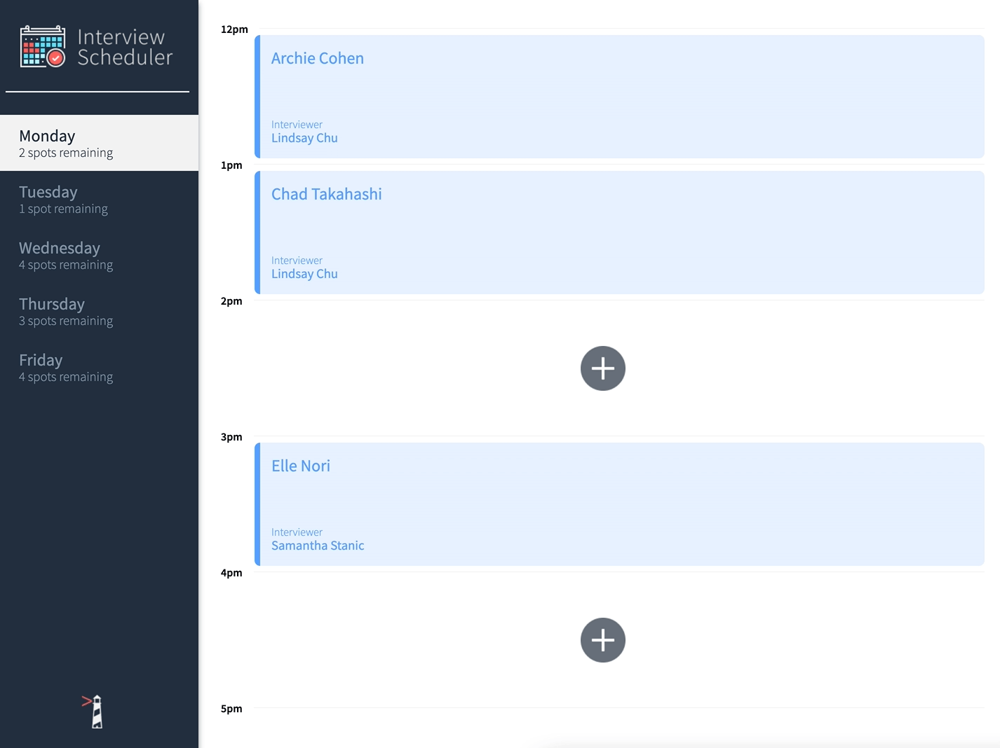
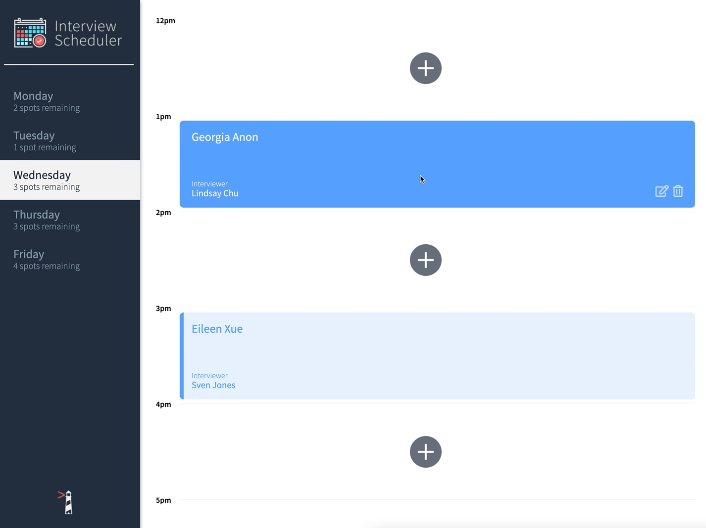

# Interview Scheduler

The Interviewer Scheduler is a single page application built with React as part of Lighthouse Lab's Web Development Bootcamp. The app allows a user to book appointments, edit and also delete their bookings. The data is served from the scheduler-api using a PostgreSQL database.

## Demo
Create New Interview Booking


Edit and Delete Interview Bookings


## Setup

Install dependencies with `npm install`.

## Running Webpack Development Server

```sh
npm start
```

## Running Jest Test Framework

```sh
npm test
```

## Running Storybook Visual Testbed

```sh
npm run storybook
```

## Dependencies
- React
- Axios
- classnames
- normalize

## devDependencies
- Babel
- Storybook
- Testing Library
